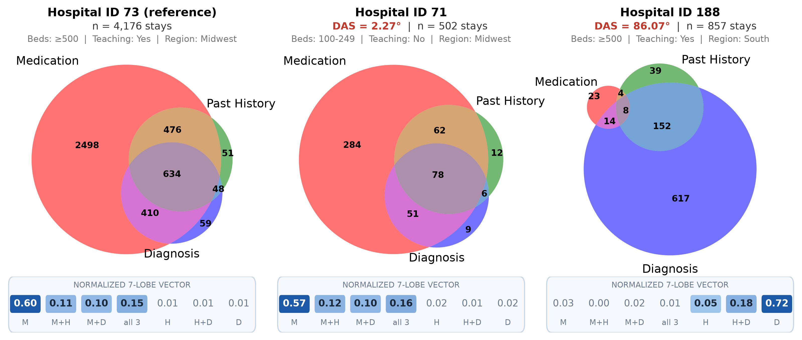
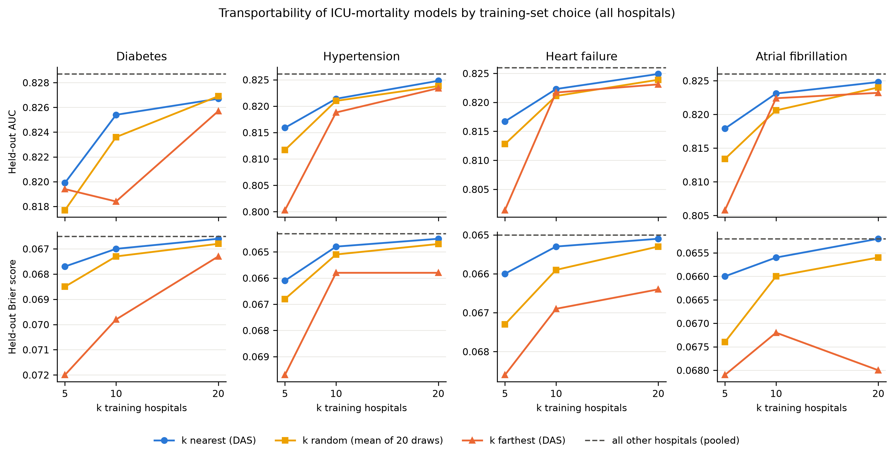

# Documentation Angular Separation (DAS)

Code for **"Site-Level EHR Documentation Variation Impacts Model Inference and Generalizability in Multi-Center Research"**
(Belouali, Kharrazi, Sun, Lehmann), an analysis of 123 to 161 hospitals in the eICU Collaborative Research Database.

## What DAS measures

Hospitals differ in *where* the EHR records evidence of a condition: in the diagnosis table, the past-history record,
the medication orders, or some combination. For one condition at one hospital, the ICU stays with any evidence are
distributed over the seven lobes of a three-source Venn diagram (three single-source lobes, three pairwise overlaps,
the triple overlap). Normalizing the lobe counts gives a seven-element **documentation vector** $\mathbf{d}$.
The documentation angular separation between hospitals $A$ and $B$ is the angle between their vectors:

$$
\mathrm{DAS}(A,B) \;=\; \arccos\!\left(\frac{\mathbf{d}_A \cdot \mathbf{d}_B}{\lVert \mathbf{d}_A \rVert\,\lVert \mathbf{d}_B \rVert}\right)
$$

DAS ranges from 0° (evidence distributed identically across sources) to 90° (no shared lobe); because all elements
are non-negative, no larger angle is possible. It needs only seven aggregate counts per condition per site, so it can be
computed and exchanged before any patient-level data are pooled. The measure extends the angular-separation concept
introduced by Lehmann and Sun within a single health system to a multi-center setting, three record types and
downstream analytic consequences.



*Figure 1. Diabetes documentation at the reference hospital (73), its documentation-nearest hospital (71, DAS 2.27°,
different size and teaching status) and a documentation-distant hospital with the same size, teaching status and region
(188, DAS 86.07°). M = medication, H = past history, D = diagnosis.*

## Key results

- **Single-source phenotype rules are not portable.** The share of diabetes stays that a diagnosis-table-only rule
  captures ranges from 0.1% to 98% across hospitals, and capture tracks DAS (Spearman ρ 0.55 for diagnosis only,
  −0.76 for medication only).
- **The DAS structure is concordant across conditions.** Pairwise DAS for diabetes, hypertension, heart failure and
  atrial fibrillation correlate at ρ 0.69 to 0.79 (Mantel p = 0.001), and at 0.40 to 0.66 among hospitals that record
  all three sources. Concordance depends on the medication rule: with mutually exclusive, condition-specific medication
  classes it stays at 0.61 to 0.72 for diabetes, heart failure and atrial fibrillation but falls to 0.35 to 0.40 for
  pairs involving hypertension.
- **DAS finds the extreme case without being told.** 16 to 28 hospitals per condition contribute no medication
  records; they sit near 90° from every other hospital and dominate the far end of every DAS ranking. Every result is
  reported with and without them.
- **Hospital descriptors explain little of it.** Region explains 11% to 19% of the squared-distance variation
  (PERMANOVA), mostly because the no-medication hospitals cluster regionally; among three-source hospitals region, bed
  size and teaching status explain 3% to 8% and are significant only for hypertension. Dispersion is homogeneous by
  region once the no-medication hospitals are excluded (PERMDISP).
- **DAS carries information for ICU-mortality models.** In logistic random-intercept models DAS explains 6% to 9% of
  between-hospital variance, beyond region, size and teaching status; most of that is the contrast between hospitals
  that do and do not record medications. The hypertension estimate is reference-dependent (8.1% with the hospital-73
  scalar, 0.9% with the reference-free centroid angle).
- **Site adjustment flips a coefficient.** The ICU-transfer effect is protective in pooled models (OR 0.88) and harmful
  with hospital fixed or random effects (OR 1.15 to 1.18): hospital transfer rates range from 0% to 46% and track
  hospital mortality.
- **DAS-guided training-site selection helps modestly.** In leave-one-hospital-out experiments, models trained on the
  k documentation-nearest hospitals beat models trained on the same number of random hospitals on AUC (differences
  +0.0005 to +0.0025 at k = 10) and Brier score in all four conditions, and beat the k farthest hospitals by more.
  Pooling every other hospital remains best, but the nearest-k models approach it with a tenth of the data. The
  hypertension AUC gain is explained by training-set size; the others are not.



*Figure 3. Held-out AUC (top) and Brier score (bottom, lower is better) of ICU-mortality models trained on the k
documentation-nearest, k random (mean of 20 draws) and k farthest hospitals, with the model pooled over all other
hospitals as a dashed reference.*

## Data

eICU-CRD v2.0 is available to credentialed users at https://physionet.org/content/eicu-crd/ and is not distributed
with this code. Place the CSV extracts under `../data/raw/` and point `configs/paths.yaml` at them.

## Reproducing the analysis

```bash
python -m venv .venv && source .venv/bin/activate
pip install -e ".[dev]"
pytest                    # unit tests for lobe encoding, Mantel, PERMANOVA
bash run_all.sh           # full frozen run (hours; see FAST=1 for a quick pass)
```

`run_all.sh` regenerates every table and figure under `../artifacts/` and
writes `../artifacts/RUN_INFO.json` (timestamp, package versions, sha256 of
every script and config). Manuscript numbers should be cited from one such
run only; do not mix runs. Place eICU CSV extracts under `../data/raw/` and
point `configs/paths.yaml` at them.

## Pipeline

| Script | What it does | Key outputs (under `artifacts/`) |
|---|---|---|
| `01_build_flags.py` | Patient-level evidence flags (Dx / Hx / Med) per condition from text rules in `configs/phenotypes.yaml` | `data/processed/flags_<cond>.parquet` |
| `02_build_vectors.py` | Hospital 7-lobe counts and normalised vectors (min patients per hospital from `configs/cohorts.yaml`) | `data/processed/{counts,vectors}_<cond>_min<k>.parquet` |
| `03_compute_distances.py` | Pairwise DAS matrices | `data/processed/dist_<cond>_min<k>.{npz,csv}` |
| `04_concordance_heatmap.py` | Cross-condition concordance of DAS matrices: Spearman rho over hospital pairs with a **Mantel permutation p-value** (hospital pairs are not independent) | `concordance/concordance_rho.csv`, `concordance_mantel_p.csv`, heatmap |
| `05_make_amia_assets.py` | Venn triptych, hospital scatter, concordance heatmap | `<cond>/figures/venn_triptych.png`, `scatter_quartile.png` |
| `06_sensitivity_thresholds.py` | Concordance at min-patient thresholds 100-500 (with Mantel p) | `sensitivity/threshold_concordance.csv` |
| `07_characteristic_scatter.py` | Do region / bed size / teaching status explain DAS? **PERMANOVA** on the full matrix (primary) plus Kruskal-Wallis on mean DAS (secondary); scatter plots coloured by characteristic | `<cond>/tables/characteristic_tests.csv`, `general/all_characteristic_tests.csv` |
| `08_regression_models.py` | ICU-mortality logistic models: patient covariates, + hospital fixed effects (Newton to convergence), + DAS, + hospital characteristics, and **logistic random-intercept (GLMM) models** with DAS as a hospital-level covariate. LRTs for nested pairs, variance decomposition, clustered SEs, stratified and per-hospital models, model comparison table | `<cond>/tables/all_model_results.csv`, `model_comparison.csv`, `likelihood_ratio_tests.csv`, `variance_decomposition.csv`, `analytic_sample_info.json` |
| `09_xgboost_prediction.py` | Leave-one-hospital-out transportability: train on k nearest vs k farthest vs k random (20 draws) vs all other hospitals by DAS (pooled logistic regression; name is historical); reports AUC, Brier, AUPRC, calibration slope and intercept | `<cond>/tables/transportability_{results,summary}.csv` |
| `10_apache_sensitivity.py` | Models on the full cohort with APACHE imputed + missing flag (sensitivity; see limitations) | `<cond>/tables/sensitivity_apache_imputed.csv` |
| `11_phenotype_fragility.py` | Capture rate of the same condition under single-source and multi-source phenotype rules, per hospital, vs DAS | `<cond>/tables/phenotype_fragility{,_corr}.csv`, figures |
| `12_transfer_decomposition.py` | Why the transfer coefficient flips sign with hospital fixed effects | `<cond>/tables/transfer_{decomposition,correlations}.csv` |
| `13_small_hospital_experiment.py` | Small hospitals (20-99 patients) borrowing models from DAS-nearest vs farthest large hospitals | `<cond>/tables/small_hospital_*.csv` |
| `14_inference_transportability.py` | Coefficient recovery from nearest vs farthest hospitals | `<cond>/tables/inference_transportability*.csv` |
| `15_pairwise_coefficient_similarity.py` | Pairwise coefficient distance vs pairwise DAS | `<cond>/tables/pairwise_coefficient_similarity.csv` |
| `16_ensemble_prediction.py` | Per-hospital model ensembles from nearest vs farthest hospitals | `<cond>/tables/ensemble_prediction_*.csv` |
| `17_zero_source_sensitivity.py` | **Sensitivity analysis excluding hospitals with no medication (or other source) records**: concordance, regression set, LOHO | `sensitivity_zero_source/*` |
| `21_reference_sensitivity.py` | Reference-hospital sensitivity: repeats the scalar-DAS analyses with angle-to-centroid, mean DAS to all hospitals, and a second reference hospital | `sensitivity_reference/*` |
| `22_figure1_composite.py` | Figure 1: three-hospital Venn triptych with headers and normalized 7-lobe vector strips, in the AMIA layout | `<cond>/figures/figure1_composite.png` |
| `23_table1_by_condition.py` | Table 1: hospitals, descriptors, DAS summaries and mortality-model samples, by condition | `general/table1_by_condition.csv` |
| `24_figure3_transport.py` | Figure 3: held-out AUC and Brier by training-set choice (nearest / random / farthest / pooled) | `general/figure3_transport*.png` |
| `25_transport_size_adjustment.py` | Size adjustment of nearest-vs-random: per-hospital metric difference regressed on training-stay difference | `general/transport_size_adjustment.csv` |
| `26_permanova_multivariable.py` | Multivariable PERMANOVA (marginal tests) and PERMDISP for region, bed category, teaching status | `general/permanova_multivariable.csv`, `general/permdisp.csv` |
| `19_collect_results.py` | Collects every number the manuscript cites into `results_numbers.md` | `results_numbers.md` |
| `20_figure_capture_by_das.py` | Figure 3: capture under single-source rules, hospitals ordered by DAS | `<cond>/figures/capture_by_das.png` |
| `18_cohort_flow_table1.py` | Cohort attrition per condition, flow diagram, Table 1 by DAS quartile, hospital characteristics by quartile | `general/cohort_flow.csv`, `cohort_flow_<cond>.png`, `table1_<cond>.csv`, `hospital_characteristics_by_quartile_<cond>.csv` |

## Statistical notes

- **Hospital fixed effects and hospital-level covariates.** DAS, DAS quartile,
  region, bed size and teaching status are constant within hospital and are
  therefore perfectly collinear with hospital dummies. Models combining them
  with hospital fixed effects are not fit; the question "does DAS explain
  between-hospital variation" is answered by the random-intercept models via
  the reduction in random-intercept variance (`variance_decomposition.csv`).
- **Optimiser.** Fixed-effect logits are fit by Newton-Raphson to convergence.
  L-BFGS with a small iteration budget under-converges these models by more
  than the AIC differences of interest.
- **Analytic sample.** All models for a condition are fit on the same sample:
  complete cases on the model variables, in hospitals with at least the
  configured number of condition patients and with outcome variation.
  Counts are recorded in `analytic_sample_info.json` and `general/cohort_flow.csv`.
- **Concordance inference.** Mantel permutation tests (hospital labels) rather
  than the naive p-value over hospital pairs.
- **Reference hospital.** The self-distance row is already present in the long-form distance CSV; scripts must not append a second one (an earlier version did, which duplicated the reference hospital's stays in every regression sample). Script 21 checks that results do not depend on the reference choice.
- **Zero-source hospitals.** eICU hospitals that contribute no medication
  table sit at ~90 degrees from every other hospital for every condition.
  Script 17 repeats the core analyses without them; report both.

## Configuration

- `configs/paths.yaml` — Local paths to eICU CSV files
- `configs/phenotypes.yaml` — Condition definitions (diagnosis / past-history / medication text rules)
- `configs/cohorts.yaml` — Min-patient thresholds per condition and sensitivity thresholds

## Conditions

diabetes, hypertension, CHF, atrial fibrillation. To add a condition, add an
entry to `configs/phenotypes.yaml` and re-run.


## Sensitivity: condition-specific medication classes

`logs/run_specific_meds.sh` reruns flags, vectors, distances, concordance (all hospitals and excluding
zero-source hospitals) and the random-intercept regressions with `configs/phenotypes_specific_meds.yaml`
(mutually exclusive medication classes for hypertension, CHF and AF; diabetes unchanged) into
`data/processed_specific_meds/` and `artifacts/sensitivity_specific_meds/` (paths in `configs/paths_specific_meds.yaml`).
